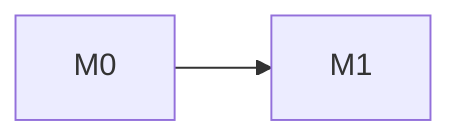

# <Project> — Implementation Plan

**Status:** draft
**Audience:** Claude Code (and humans reviewing its work)
**Execution:** guided
**Companions:** <spec/design docs, if any> · [Milestone index](milestones/README.md) · [Follow-up ledger](follow-ups.md)
**Written against:** `<sha>` (<YYYY-MM-DD>)
**Last updated:** <YYYY-MM-DD> — initial draft.

---

## 0. How to use this document

<!-- What this doc is and how it relates to the companions. Then the numbered rules, adapted but keeping all four: -->

Rules for working from this doc:

1. **Do not re-litigate §2.** Those decisions were made with the alternatives on the table; reversing one is a dated, reviewed edit to §2, not a mid-implementation judgement call.
2. **Milestones in §8 are gated.** Do not start a milestone until every predecessor in §8's dependency graph has landed (or is code-complete, awaiting only a user check) and its execution doc is `approved`. A milestone is done when its acceptance criteria pass, not when the happy path demos.
3. **`[VERIFY]` marks an unconfirmed assumption.** The milestone that owns it (§11) resolves it in place, removes the tag, and records the answer in §11.
4. **Execution detail lives in `milestones/`.** This doc defines *what* and *in what order*; each milestone doc defines *how* the work is divided and records what actually shipped.

---

## 1. Goal and non-goals

### Goal

<!-- 1–2 paragraphs: what exists when this is done and who it serves. -->

### Non-goals

<!-- Bullets. Each one a thing a reasonable person might assume is in scope. -->

### Definition of done (whole project)

<!-- One paragraph, observable: the end-to-end scenario that proves it works. -->

---

## 2. Decisions already made

<!-- One ### per decision, Rejected before Chosen when they're alternatives to each other. Each: bulleted reasons, then a one-word verdict line. Record the cost of the chosen path, not just its benefits. -->

### 2.1 Rejected: <alternative>

- <reason>

Rejected.

### 2.2 Chosen: <approach>

- <reason>
- **Cost:** <what this makes harder>

---

## 3. Reference material

| Source | Use for |
|---|---|
| <doc/url/repo> | <what to consult it for> |

---

## 4. Stack

<!-- Pin versions. A dependency added here must have been approved with "what it does / the alternative without it". -->

| Concern | Choice | Notes |
|---|---|---|
| <runtime/lang> | <choice + version> | <why / constraint> |

---

## 5. Repository layout

<!-- ASCII tree. Every file/dir annotated with the milestone that introduces it (and § that specifies it). A path with no owning milestone is a planning gap. -->

```
<root>/
  src/
    <Project>/            # M0 — <role> (§6)
  tests/
    <Project>.Tests/      # M0
  docs/
    implementation-plan.md
    milestones/
    fu/                   # one file per follow-up
    follow-ups.md         # generated index, for humans
```

---

## 6. <Specification — e.g. Execution model / Architecture>

<!-- The spec proper: one ## per subsystem (renumber following sections). As detailed as the hard parts need: contracts as code, pseudocode for the core algorithm, config examples with "Rules:" bullets, tables. Bold-callout the rule that matters most. Mark unconfirmed facts [VERIFY]. -->

### 6.1 <Subsystem>

---

## 7. Conventions

<!-- Project-specific, grep-able rules. Anything checkable by grep gets repeated as an acceptance criterion in every milestone doc. -->

- Traceability tags (grep targets, not explanatory comments): `// ASSUMPTION(Qn):` on code resting on an assumption-register answer; `FU-NNN` where code knowingly defers a ledger item.
- Tests for "not implemented / unsupported" paths use reserved fake names (`x-not-a-real-<thing>`), never a real feature that isn't built yet.
- <naming / layering / error-handling rules>

---

## 8. Milestones

Each milestone below is a **gate definition**. Its execution doc in [`milestones/`](milestones/README.md) divides the work and records what shipped; this section stays the gate.

### M0 — Foundation

_Execution doc: [`milestones/M0-foundation.md`](milestones/M0-foundation.md)_ · **Status:** not written

<!-- 1–3 sentences of scope. -->

**Acceptance:**
- <observable by a test or command>

### M1 — <Title>

_Execution doc: [`milestones/M1-<slug>.md`](milestones/M1-<slug>.md)_ · **Status:** not written

**Acceptance:**
- <…>

### Dependency graph



<!-- Then: which milestones can run in parallel and why; which are strictly sequential. -->

---

## 9. Testing strategy

<!-- The chosen approach (smoke / detailed unit / TDD) and what it means per milestone: unit, integration, golden/fixture tests, how acceptance criteria map to named tests, CI gates. -->

---

## 10. Cross-cutting practices

<!-- Every-milestone obligations: docs stay live (doc-sync after every WP in guided mode, once per merged wave in swarm mode), /followup before a WP is done, error-path tests written with the feature, build warnings policy. -->

---

## 11. Assumption register

<!-- Every [VERIFY] in this doc has a row. Owner = the milestone that must resolve it. Basis once answered: documented / toolkit / assumed. Pinned by = the test that fails if the answer is wrong. -->

| Q | Question | Owner | Answer | Basis | Pinned by |
|---|---|---|---|---|---|
| Q1 | <question> | M<n> | _open_ | | |

---

## 12. Deferred beyond this plan

<!-- One paragraph or bullets: what comes after, so it's visibly out rather than forgotten. -->
