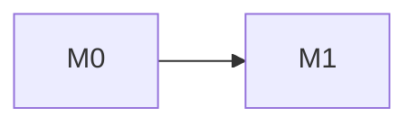

# Milestone execution docs — index

This directory divides [`<plan>`](../<plan>.md)'s milestones into work packages: design questions, file ownership, frozen contracts, acceptance checklists, and an as-built record filled in after each milestone lands. **The plan remains the single source of truth for *what* correct behavior is** — these docs are about *how the work is sequenced and divided*, and reference the plan by section rather than restating it.

Start here when picking up work: find the first milestone whose `Depends on:` have all landed (or await only a user check) and run `/implement <id>` — it refreshes a doc written ahead of time before starting. To review first, read its Entry criteria, Design questions, and work packages.

## Documents

| Doc | Milestone | Gate |
|---|---|---|
| [`M0-foundation.md`](./M0-foundation.md) | Foundation | prerequisite skeleton + first contracts |

<!-- No status column — status lives in each doc's header and the plan's gate line. -->

<!-- If any a/b splits exist, one paragraph each: parallel halves under one shared gate, or a sequential split with separate gates — and why the split exists. Otherwise delete this comment. -->

## Dependency graph

## Parallelism matrix

| Can run concurrently | Why |
|---|---|
| <M2 ∥ M3> | <what each needs and why they don't collide> |

<!-- Include WP-level parallelism inside milestones where it matters. End with the hard sequential spine: "Everything else is sequential: M0 → M1 → …". -->

## Multi-agent protocol

<!-- Always in full: docs are swarm-ready whatever the Execution mode. -->

1. **File ownership is exclusive within a work package.** No two concurrently running work packages edit the same file. A later milestone extending an earlier one's file does so as a marked *sequential* extension, never while the owner is open.
2. **Contracts are frozen at the doc that introduces them.** A consumer needing a different shape records a deviation in its own as-built record and adds a back-note to the owner's.
3. <Project-specific rule that avoids shared edit hotspots — e.g. registration by discovery instead of a shared list. Delete if none.>
4. **Every work package closes with** its tests passing and any deferred item or surprising constraint logged via `/followup` before it counts as done.
5. **Before starting a milestone, scan the ledger's index** (`<relative path to ledger>`) for open entries whose Areas overlap, and address or explicitly re-defer them in the doc's reconciliation table.
6. **`[VERIFY]` tags and register questions are answered in place** in the plan by the milestone that owns them — never left for someone else once that milestone starts.
7. **Shared hotspots are pre-edited in `WP<n>.0`** (package refs, project/solution files, registries), so parallel work packages never edit the same manifest.
8. **Workers never edit docs or the ledger.** They report; the coordinator assigns follow-up ids and runs doc-sync on main after every merge.

## Execution modes

Each milestone doc's `Execution:` says how it gets implemented: **guided** (one work package at a time, pausing for review after each) or **swarm** (parallel worktree agents, as far as `After:` ordering and file ownership allow). The docs themselves are identical either way; switch with `/milestone mode`.

## Shared conventions

<!-- Restate the plan's grep-able / every-WP conventions here (from §<Conventions>), because every work package must apply them. -->

## Section profile

<!-- The project-specific sections every milestone doc carries between "Test requirements" and "Acceptance criteria" (e.g. "Trace obligations", "Seam changes — Engine.Graphics"), and any renamed default sections. /milestone reads this to keep new docs consistent. If none: "Default sections only." -->

## As-built rules

A milestone doc's As-built record is filled only after that milestone's acceptance criteria pass — never speculatively, never partially. Work packages that land earlier note it inline on the WP (`**Status: ☑ landed** (<sha>)`). Once landed, the doc is frozen: corrections are new dated entries, never rewrites. The gap between planned and actual is the point of the record — a plan that matched reality exactly is the rare case, not the assumed one.
